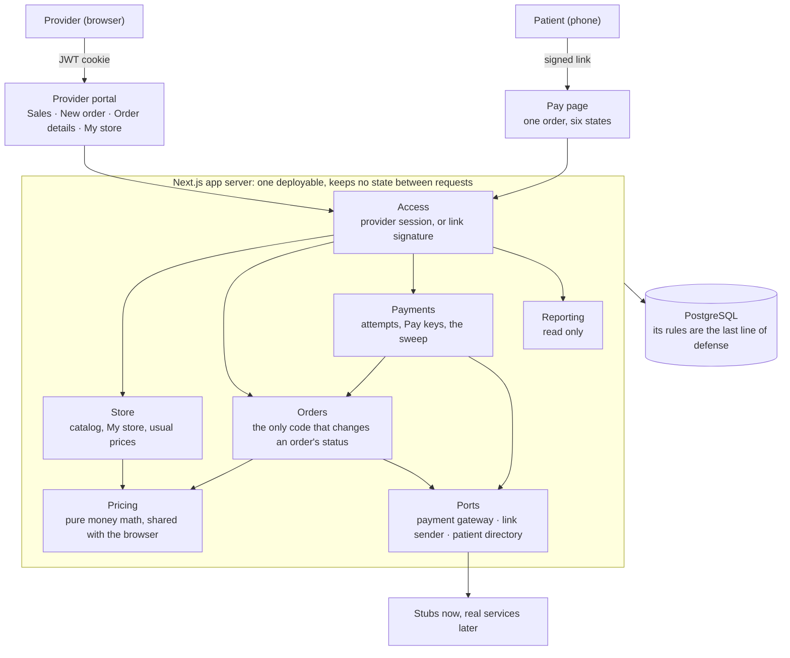
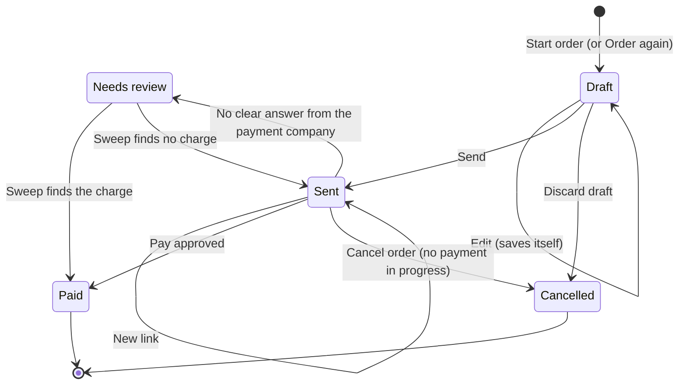
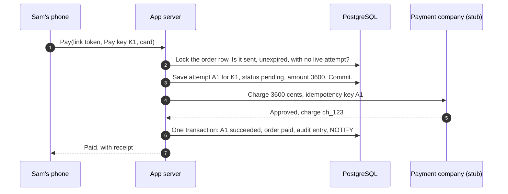
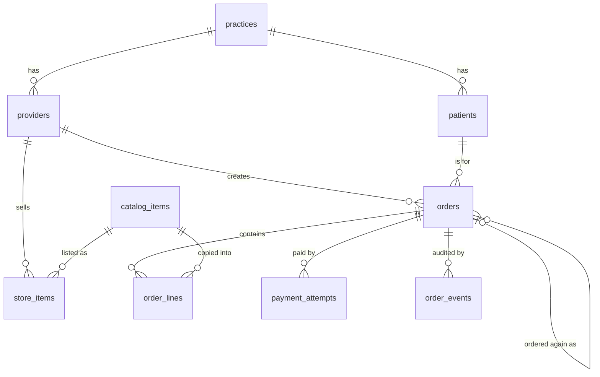
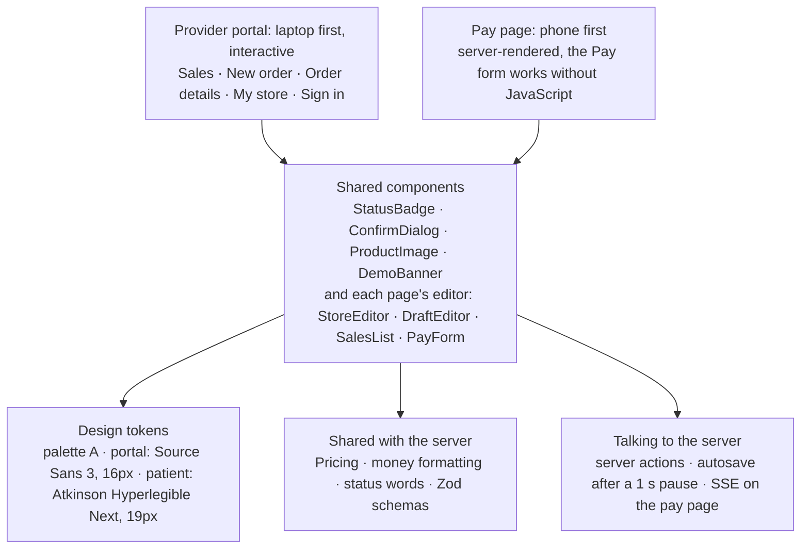
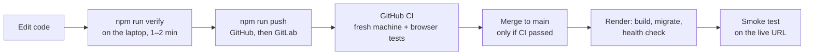

# Architecture

How the supplement-ordering slice is built: the scale it's built for, the parts and their seams, the order lifecycle, the payment flow, the data model, the frontend, and the order of work. Agreed with the user on 2026-10-06.

What we're building and why is in [PROBLEM_SPACE.md](PROBLEM_SPACE.md). Users and UX flows (F1–F5) are in [USERS.md](USERS.md). Each decision's trade-off is in [DECISIONS.md](DECISIONS.md) (D1–D73). Status lives on the Notion board in [status-board.md](status-board.md), not here.

Examples use one running order: **Dr. Rivera** sends **Sam** one bottle of Magnesium Glycinate at **$36.00**. Its retail price (MSRP) is $40.00, and it costs us $20.00. The fee is $0.27 and Dr. Rivera's margin is $15.73.

## Contents

1. [Summary](#1-summary)
2. [Scale and availability](#2-scale-and-availability)
3. [System overview](#3-system-overview)
4. [Order lifecycle](#4-order-lifecycle)
5. [The Pay flow](#5-the-pay-flow)
6. [Pay links](#6-pay-links)
7. [Data model](#7-data-model)
8. [Data flows and API contracts](#8-data-flows-and-api-contracts)
9. [Frontend](#9-frontend)
10. [Security and privacy](#10-security-and-privacy)
11. [Observability](#11-observability)
12. [Stack and hosting](#12-stack-and-hosting)
13. [Testing and delivery](#13-testing-and-delivery)
14. [Configuration](#14-configuration)
15. [Repository layout](#15-repository-layout)
16. [Build order](#16-build-order)
17. [Known limitations](#17-known-limitations)
18. [Not built: recurring orders](#18-not-built-recurring-orders)

## 1. Summary

- **One Next.js app server and one PostgreSQL database.** The server is written in TypeScript and keeps no state between requests. The market leader serves this whole market with a single Rails application, so splitting services would buy nothing at our scale.
- **Money is integer cents, with the split frozen when the order is sent.** The database refuses any line whose cost, fee and margin don't add up to its price.
- **The payment step saves before it charges.** A failure at any point leaves something we can find and settle, never money taken with no record. A database rule makes a second charge for the same order impossible.
- **Built and load-tested for the market leader's volume.** That's about 20,000 orders a day, or about 3 orders a second at the busiest hour. The path to the whole US market is written down, not built.
- **Stubbed:** payments, login, email, the EHR patient list, and payouts. Each sits behind a port with a clean seam ([§3](#stubs-and-seams)).

## 2. Scale and availability

### How big it can get

Researched 2026-10-06. Sources are [listed below](#scale-sources). "Busiest hour" multiplies the average by 6–10×, combining weekday clinic hours (98% of visits are on weekdays) with seasonal demand (immune supplements sell 2.27× more in winter than in summer). Shopify's Black Friday peak minute is about 7× its yearly average.

| Level | Patients | Orders a day | Average | Busiest hour |
|---|---|---|---|---|
| **1. The market leader's volume today** (Fullscript, our estimate) | ~5M a year, 125k providers | ~20k (12k–30k) | 1 order every ~4 s | **~3 a second** |
| 2. Every US patient who buys through a practitioner | 5–11M | 165k–250k | 2–3 a second | ~20–30 a second |
| 3. Every US supplement user, ordering monthly | ~200M | ~6.6M | ~77 a second | ~500–800 a second |

**We build and test for Level 1 (D18).** The demo runs far below it.

Each order writes about 10–15 rows: the order, its lines, its status events, and its payment attempt. At Level 2's busiest hour that is about 300–450 row writes a second, which one Postgres server handles comfortably. At Level 3 it is about 12,000 a second, which needs the changes in the scaling path below.

Fullscript's engineering blog reports 10M web requests a day in 2023, served by one Rails application on two MySQL databases and one Postgres database. That works out to about 5 orders per provider per month, so each provider's Sales data stays small.

### Traffic patterns that matter

| Pattern | Effect | Design response |
|---|---|---|
| **The same order at the same moment:** a double-clicked Pay, two tabs, a link sent twice | A correctness risk at any scale | The Pay flow's guards ([§5](#three-guards-against-a-double-charge)) |
| **Many links sent at once** | 20%+ of emails are opened in the first hour, which could mean 20–100× normal traffic for that hour | We have no bulk send. Rule: if reminders are added later, spread them out. The pay page is one lookup by link. |
| **Weekday middays and seasonal peaks** | 6–10× the average hour | The Level 1 load test runs at this rate |
| **Sales totals** | The most expensive query per page load, though small per provider | Indexes on provider plus date ([§7](#indexes)). Platform-wide totals and reconciliation run as commands, not on page load. |
| **Evenings and weekends** | 15–27% of patient payments happen when offices are closed | No downtime window. Production migrations must not take the site offline. |
| **US time zones** | The busy window runs from 9am Eastern to 5pm Pacific, about 11 hours | Spreads the peak. Monthly totals use a stated time zone ([§8](#sales-list-search-filters-and-totals)). |

### Scaling path

| | **Level 1 (built)** | Level 2 | Level 3 |
|---|---|---|---|
| Busiest hour | ~3 orders/s | ~20–30 orders/s | ~500–800 orders/s |
| App server | 1 copy | Several copies behind a load balancer | Many copies |
| Database | One Postgres | Add a read-only copy for Sales and reports. Precompute monthly totals. | Split orders into monthly tables (partitions). Spread practices across several databases. Move reporting to its own store. |
| Background work | The sweep runs on a timer inside the app | The sweep holds an advisory lock so only one copy runs it. Link sends go through a queue and are spread out. | A queue for payment results and link sends |
| SSE updates | Postgres LISTEN/NOTIFY | Same, since any copy can notify any other | A message bus |

**What we do now so these steps don't need a rewrite:**
- The app keeps nothing in memory between requests.
- Every provider query filters by provider. Each provider belongs to a practice, which gives Level 3 a natural key for splitting the data.
- Timestamps are UTC, and the sent and paid times are indexed, which makes monthly partitions possible later.
- Reporting only reads.
- External calls go through ports.
- Status changes are announced through LISTEN/NOTIFY from day one.

### Availability

- **Backups, no standby (D19).** In production, the database would be a managed Postgres with point-in-time restore. A standby copy that takes over automatically is the next step if the 99.9% target matters.
- **The demo has free-tier limits.** Neon Free keeps a 6-hour restore window, and the seed rebuilds all demo data.
- **The design fails safely.** If the database is down, a provider's save fails with a message. Pay fails *before* any charge, because the attempt must be saved first. Paid orders are safe as long as the data survives.
- **Target: 99.9%,** about 43 minutes of downtime a month, measured over clinic hours. Fullscript reports 99.999%, about 5 minutes a year.

### Response time

**Target: during the Level 1 load test, 95% of requests finish on our server within 500 ms.** Three sources support it:
1. **Nielsen Norman Group:** a response within 1 second keeps "the user's flow of thought" unbroken ([NN/g](https://www.nngroup.com/articles/response-times-3-important-limits/)).
2. **Google's web.dev:** a time to first byte of 0.8 s or less is "good" for 75% of visits. That time includes DNS, connecting, and redirects ([web.dev](https://web.dev/articles/ttfb)).
3. **Lighthouse:** fails a page when the server takes more than 600 ms to respond ([Chrome docs](https://developer.chrome.com/docs/lighthouse/performance/server-response-time)).

500 ms stays under Lighthouse's limit, leaves about 300 ms of the 800 ms for a slow phone network, and holds for 95% of requests rather than 75%. On a laptop the network adds almost nothing, so the test measures our server alone. The payment stub answers instantly. A real Pay also waits on the payment company, which this target doesn't include.

### Load tests

All load tests run on the user's laptop, with **k6**. Results are in [LOAD_TESTS.md](LOAD_TESTS.md) (D18, D71): Level 1 passes with 95% of requests within 40 ms, the single app server's CPU is the first thing to slow at Level 2, and the money reconciles at every level and through the outage drill.

Each simulated order makes the requests a real one would:
- **Provider:** start the order, autosave twice, send.
- **Patient:** open the pay page, pay.
- **Sales:** one page load for every five orders.

| Test | What it does | Pass bar |
|---|---|---|
| **Same-order race** | 50 Pays at once on one order, mixing repeated and new Pay keys; 20 Sends at once on one draft | Exactly one charge reaches the stub, and exactly one link. This also runs in CI. |
| **Level 1** | ~3 orders/s for 10 minutes | **Must pass:** no errors, 95% of server time under 500 ms, reconciliation clean afterwards |
| **Level 2** | ~30 orders/s | Record the result and the first thing that slows down |
| **Level 3** | ~800 orders/s | Expected to fail. On a laptop it mostly measures the laptop, and the report says so. It shows where the Level 3 changes become necessary. |
| **Database outage drill** | Stop the database partway through the Level 1 test, then restart it | No double charges, no paid order lost, and reconciliation clean afterwards. Pay requests made during the outage fail with a clear message. |

### Scale sources

- **Fullscript:**
  - 125,000 providers and 5M+ patients a year (April 2026). A September 2026 release says 10M; the two conflict.
  - $1B+ revenue in 2025.
  - 250k orders a month in about 2021, per a vendor case study.
  - 10M requests a day in 2023 ([builders.fullscript.com](https://builders.fullscript.com/posts/fullscript-engineering-2023-wrapped)).
  - A Rails monolith with MySQL and Postgres ([rubyonrails.org](https://rubyonrails.org/2025/8/6/fullscript-joins-rails-foundation)).
- **US market:**
  - 341.8M people (Census V2025).
  - 60.2% of adults used a supplement in the past 30 days ([CDC NHANES](https://www.cdc.gov/nchs/products/databriefs/db561.htm)), and 75% in the past year (CRN 2024).
  - The practitioner channel is about $6–6.8B a year (Nutrition Business Journal 2025–2026).
- **Traffic timing:**
  - NAMCS weekend visits: 2.0%.
  - Patientco: 27% of payments made after hours.
  - Shopify BFCM 2024: about 9 database reads per write.
  - SPINS: immune supplement seasonality.
- **Average order value:** no public figure, so **$100 is assumed.** Every order count above depends on it.

## 3. System overview



### Modules

| Module | Owns | Rules |
|---|---|---|
| **Access** | Who is calling: a provider from the JWT cookie, or one order from a pay-link signature | Every provider query filters by that provider. A link opens exactly one order. |
| **Store** | The catalog, My store, and usual prices | Prices are checked by Pricing. Removing an item never touches a sent order. |
| **Orders** | Drafts, lines, Send, New link, Cancel order, Order again, and **every status change** | Changing an order means locking its row first. Each change writes an audit event in the same transaction and announces itself through NOTIFY. |
| **Payments** | Payment attempts, Pay keys, and the sweep | Saves the attempt before charging. Asks Orders to mark an order paid, and never sets the status itself. |
| **Reporting** | The Sales list, totals, Order details, and the reconciliation check | Read only |
| **Pricing** | Fee, margin, lowest price, price from margin, and the range check | Pure functions on integer cents, with no reads or writes. The same module runs in the browser. |
| **Ports** | `PaymentGateway`, `LinkSender`, `PatientDirectory`, `Inventory` | The only way out to external services |

The business modules live in `src/server/` and **never import Next.js.** Next.js routes and server actions only pass requests to them. That keeps them testable without a browser and leaves a clean seam if they ever move into their own service.

### Stubs and seams

The PRD asks us to say what's stubbed.

| Stubbed | In the slice | Real version plugs in at |
|---|---|---|
| **Payments** | A stub payment company. Test card numbers choose the outcome ([§5](#test-cards-and-demo-timings)). It keeps its own records in a separate file, never in our database. | `PaymentGateway.charge` and `lookup`. A Stripe Connect-style charge that later transfers the margin to the provider. Card details go straight to the payment company and never touch our server. |
| **Login** | Pick a provider from a list. The result is a real signed JWT in an HttpOnly cookie. | The identity service vouches for the provider, and the same cookie carries it (D32) |
| **Email and SMS** | Send is recorded as an audit event, and the provider copies the link | `LinkSender.send`. The subject line never contains product names. |
| **EHR patient list** | Seeded patients for each practice | `PatientDirectory.search` |
| **Inventory** | When an order is paid, each product and quantity is recorded on its audit trail ("Inventory updated: 2 × Magnesium Glycinate"). No stock is counted (D84). | `Inventory.recordSale`, called in the transaction that marks the order paid. A real version writes an outbox row there, and a worker sends it to the warehouse system, which owns the counts. |
| **Payouts** | Earnings are worked out from paid orders | A payouts table and a job that transfers the margin |

## 4. Order lifecycle



**Paid** and **Cancelled** are final. Refunds would later add statuses after Paid.

**Two statuses are worked out, not stored:**
- **Expired:** the order is sent and its link expiry has passed.
- **Payment in progress:** the order has a pending attempt.

| Move | Who | Allowed when | Provider sees | Patient sees |
|---|---|---|---|---|
| → **Draft** | Provider picks a patient, or clicks **Order again** on a past order | My store has at least one item. The patient is in the provider's practice. | The draft saves itself as they work | Nothing yet, because there's no link |
| Draft → Draft | Provider edits | Always. Out-of-range prices are saved too, so no work is lost. | "Saving…", "Saved", or "Not saved, retrying". An out-of-range line shows the allowed range, and Send is disabled. | — |
| Draft → **Sent** | **Send** | At least one line, and every price in range against **today's** cost and retail price | "Sent to Sam", with the link and **Copy link**. The order locks. | The link works |
| Draft → **Cancelled** | **Discard draft** | Always | "Draft discarded" | — |
| Sent → Sent | **New link** | No payment in progress | A new link. The old link stops working, and the 30 days restart. | The old link shows "isn't valid" |
| Sent → **Paid** | Patient's Pay, or the sweep | The Pay flow | "Paid. You earned $15.73." | Receipt |
| Sent → **Needs review** | System | The payment company gave no clear answer | "Needs review. We're confirming a payment; nothing for you to do." | "We're confirming your payment" |
| Needs review → Paid or Sent | The sweep | Charged, or confirmed not charged | Paid, or back to Sent | Receipt, or "Your payment didn't go through. You haven't been charged." |
| Sent → **Cancelled** | **Cancel order** | No payment in progress | "Order cancelled" | "This order is no longer available" |
| Sent, after 30 days | Time | — | "Expired", with New link and Cancel order | "This link has expired" |

Two staff editing the same draft is out of scope; the last save wins. Each action keeps one verb throughout: Send becomes "Sent", Cancel order becomes "Order cancelled", and Discard draft becomes "Draft discarded".

## 5. The Pay flow

**The core problem:** two systems have to agree on whether Sam paid $36.00, our database and the payment company, and no single transaction can update both. Every rule below exists so that a failure at any point leaves something we can find and settle. It must never leave money taken with no record, and it must never charge twice (D21–D24).



1. **The browser sends the link token, a Pay key, and the card.** It never sends the amount.
   - **Link token:** identifies the order ([§6](#6-pay-links)).
   - **Pay key K1:** generated when the page was built and sent in a hidden form field, so Pay also works without JavaScript.
   - **Card:** stubbed. In the real version it goes straight to the payment company.
2. **The order row is locked** and the order is checked: sent, not expired, and no live attempt.
3. **The attempt is saved as pending before any money moves.** This is the key rule. If we charged first and then crashed before saving, Sam would be charged with no record, would pay again, and would be charged $72.00.
4. **The charge uses the attempt's own ID** as the payment company's idempotency key. Payment companies remember these keys (Stripe for at least 24 hours), so repeating a charge with the same key returns the first result instead of charging again.
5. **Recording success is one transaction** made of conditional writes:

```sql
BEGIN;
UPDATE payment_attempts SET status = 'succeeded', charge_ref = 'ch_123', settled_by = 'request', settled_at = now()
 WHERE id = :a1 AND status = 'pending';                       -- must change exactly 1 row
UPDATE orders SET status = 'paid', paid_at = now(), paid_attempt_id = :a1
 WHERE id = :order AND status IN ('sent', 'needs_review');    -- must change exactly 1 row
INSERT INTO order_events (order_id, kind, actor_type, at) VALUES (:order, 'paid', 'patient', now());
SELECT pg_notify('order_status', :ref);
COMMIT;  -- if either UPDATE changed 0 rows: ROLLBACK
```

The `WHERE` conditions stop the same approval being recorded twice. That can happen when Sam's original request is slow to finish and the sweep reaches the same attempt at the same moment. Whichever commits first wins, and the other changes 0 rows and rolls back.

### Every place it can break

| It breaks at… | Database shows | Sam sees | How it's settled |
|---|---|---|---|
| Steps 2–3 (database down) | Nothing | "We couldn't take your payment. You haven't been charged." | Nothing to settle |
| Between steps 3 and 4 (server crash) | A1 pending, no charge | An error. On reload: "We're confirming your payment." | The sweep asks about A1: never seen. A1 becomes *failed*, and Sam can pay again. |
| Step 4, declined | A1 declined | "Your card was declined. You haven't been charged." | Nothing to settle. The page builds a new Pay key. |
| Step 4, no answer (timeout) | A1 pending, order **needs review** | "We're confirming your payment." | The sweep asks about A1. Charged: paid. Not charged: A1 fails and the order goes back to sent. |
| Step 5 fails after approval | A1 pending, order sent. The money was taken. | "We're confirming your payment." | The sweep finds ch_123 and records step 5 |
| Step 6, the reply is lost | Paid | Spinner or error. On reload: "Already paid", with the receipt. | Nothing to settle |

### The sweep

- **When it runs:** every `SWEEP_EVERY_MS`, **and once when the server starts.** It runs inside the app, started from `instrumentation.ts` on the Node runtime only, and needs a server that stays running.
- **What it checks:** attempts that have been pending longer than `SWEEP_AFTER_MS`, a threshold kept longer than the payment timeout.
- **What it does with each:** **asks** the payment company about it (`lookup`, never a second `charge`), then settles it with the same conditional writes, recording `settled_by = 'sweep'`.
- **When it can't settle one:** the order stays in needs review for a person.
- **Level 2:** a Postgres advisory lock lets only one app copy run each sweep.

### Three guards against a double charge

| Situation | Guard | Enforced by |
|---|---|---|
| **The same request twice:** a double click, or the browser retrying after a network blip | K1 is already saved, so the server returns K1's result | A unique index on `payment_attempts.idempotency_key` |
| **Two requests for one order:** two tabs, two phones | At most one attempt per order can be pending or succeeded. The second gets "payment in progress" and never reaches the payment company. | The order-row lock, plus the partial unique index `one_live_attempt_per_order` |
| **Anything else (a bug)** | An order becomes paid only from sent or needs review, and only one attempt per order can succeed | The conditional updates above, plus that index and the paid-attempt foreign key ([§7](#database-rules)) |

The index alone already stops two charges, because the second save is refused before any charge is made. The lock is for checks that span the order and its attempts, most of all **Cancel order**. Without the lock, a cancel and a Pay could each pass their checks at the same moment, and Sam would be charged for a cancelled order. Cancel order and New link take the same lock. The lock is per order, so it never slows down anyone else's order.

### What the patient sees

**An unexplained failure always shows "confirming", never "declined" (D23).** The two possible mistakes cost very different amounts:
- **Wrongly saying "confirming":** the page corrects itself within seconds.
- **Wrongly saying "declined":** Sam might pay another way and spend $72.00, or dispute a charge that was real.

| The pay action returns | Sam sees |
|---|---|
| `paid` | Receipt |
| `declined` (the payment company said so) | "Your card was declined. You haven't been charged. Try another card." |
| `not_charged` (we know nothing was charged, such as a failure before the attempt was saved) | "We couldn't take your payment. You haven't been charged. Please try again in a few minutes." |
| `in_progress` (another tab) | "We're confirming your payment." |
| `confirming`, or no answer before the timeout | **"We're confirming your payment. Don't pay again. This page updates by itself."** |
| A network error, a server error, or a page that can't load (such as the database being down) | **"We couldn't load this page. If you just paid, don't pay again: your payment may still be going through. Reload this page in a moment."** It never says "declined" (D73). |

While confirming, the page listens on SSE (`/pay/[token]/events`):
- **The first event is the current status,** so a reconnect never misses a result.
- **A heartbeat goes out every 15 s.**
- **The stream closes after 5 minutes.** The page then says: "Still confirming. You won't be charged twice. You can close this page and reopen your link later."
- **Updates arrive through Postgres NOTIFY,** so they reach the right connection whichever server copy holds it (D24).

### Test cards and demo timings

The stub reads the outcome from the card number, the way Stripe's test mode does. These cards exist only in the stub, which is wired in only when `PAYMENTS_MODE=stub`.

| Card | The stub… | Shows in the demo |
|---|---|---|
| 4242 4242 4242 4242 | approves at once | The normal path |
| 4000 0000 0000 0002 | declines at once | The decline message, then a retry |
| 4000 0000 0000 0101 | charges, then stays silent past our timeout | Needs review, then the sweep, then Paid |
| 4000 0000 0000 0200 | stays silent and doesn't charge | Needs review, then the sweep, then "didn't go through", then Pay again |
| 4000 0000 0000 0309 | charges, waits `STUB_SLOW_APPROVE_MS` (shorter than our timeout), then approves | With the local database stopped during the pause, step 5 fails for real, and the sweep repairs it once the database is back |

The slow-approve demo is recorded on the laptop, because the hosted database can't be stopped on camera. Automated tests cover the same case by making the step 5 write fail.

## 6. Pay links

**Signed links (D25).** A link looks like `/pay/K7Q2-M9XD.<signature>`:
- **The order ref** (`K7Q2-M9XD`) is 8 random characters from an alphabet without 0, O, 1, I or L. It appears in links, portal URLs, and the receipt. Because it's random, it reveals nothing about how many orders exist.
- **The signature** is `HMAC-SHA256(LINK_SIGNING_KEY, "<ref>:<link_version>")`, cut to 128 bits and base64url-encoded. The server recomputes it and compares the two with `timingSafeEqual`, so the check takes the same time whether a link is close to valid or not.
- **The database stores no secret.** Copy link works at any time, and a double-clicked Send returns the same link.
- **New link** raises `link_version` by one, which makes every older signature fail, and restarts the 30 days.
- **Changing `LINK_SIGNING_KEY` turns off every live link.** That's the cost of this design, and we accept it.

**Expiry.** A link can start a payment for **30 days** after it's sent. A payment already in progress still settles after that. Expired is worked out on the fly, not stored.

**What a link shows:**

| Signature check | Order state | Page |
|---|---|---|
| Passes | Sent | Checkout |
| Passes | Payment in progress, or needs review | "We're confirming your payment" |
| Passes | Paid | "Already paid", with the receipt |
| Passes | Cancelled | "This order is no longer available. Contact Lakeview Family Practice if you still need these items." |
| Passes | Expired | "This link has expired. Contact Dr. Rivera's clinic for a new one." |
| **Fails** (replaced by New link, broken, made up, or signed with an old key) | — | **"This link isn't valid. If your provider sent you a newer link, use that one. Otherwise, contact the clinic that sent you this link."** HTTP 404. Reveals nothing, not even whether the order exists. |

Links never appear in logs, and the pay page sends no `Referer` header. Product names never appear in a link or an email subject.

## 7. Data model



All money is **integer cents**. Every timestamp is `timestamptz`, stored in UTC.

| Table | One row is | Columns |
|---|---|---|
| **practices** | A clinic | `id`, `name`, `time_zone` (IANA, e.g. `America/Los_Angeles`) |
| **providers** | A clinician | `id`, `practice_id`, `display_name` ("Dr. Rivera") |
| **patients** | A patient (seeded, standing in for the EHR) | `id`, `practice_id`, `first_name`, `last_name`, `email`. Minimal, and never logged. |
| **catalog_items** | A product we stock | `id`, `brand`, `name`, `size_label`, `image_path`, `image_alt`, `cost_cents`, `msrp_cents`, `active` |
| **store_items** | An item in a provider's My store | `provider_id`, `catalog_item_id`, `usual_price_cents`, `updated_at`. The primary key is the pair. |
| **orders** | One order for one patient | `id`, `ref` (unique), `provider_id`, `practice_id`, `patient_id`, `source_order_id` (from Order again), `status`, `link_version`, `link_expires_at`, `fee_rate_bps`, `total_cents`, `cost_cents`, `fee_cents`, `margin_cents`, `paid_attempt_id`, `created_at`, `sent_at`, `paid_at`, `cancelled_at`, `updated_at` |
| **order_lines** | One product on an order | `id`, `order_id`, `catalog_item_id`, `quantity` (1–10), `unit_price_cents`, `frozen_at`. **Frozen at Send:** `unit_cost_cents`, `fee_rate_bps`, `unit_fee_cents`, `unit_margin_cents`, `unit_msrp_cents`, `product_name`, `image_path`, `image_alt` |
| **payment_attempts** | One try at paying | `id` (also the payment company's idempotency key), `order_id`, `idempotency_key` (the page's Pay key), `amount_cents`, `status` (`pending`, `succeeded`, `declined`, `failed`), `charge_ref`, `settled_by` (`request` or `sweep`), `created_at`, `settled_at` |
| **order_events** | One audit entry | `id`, `order_id`, `kind`, `actor_type` (`provider`, `patient`, `sweep`, `system`), `actor_id`, `at`, `details` (`jsonb`, never patient data) |

**Column details** (D45):
- **IDs** are `uuid`, filled in by the database with `uuidv7()` (built into Postgres 18). `store_items` has no `id`; its key is the pair.
- **Statuses** are `text` with a `CHECK` on exactly these words: orders `draft`, `sent`, `needs_review`, `paid`, `cancelled`; payment attempts `pending`, `succeeded`, `declined`, `failed`; `settled_by` `request`, `sweep`; `actor_type` `provider`, `patient`, `sweep`, `system`.
- **`ref`** is unique `text`, stored the way links show it (`K7Q2-M9XD`). Orders generates it (M3).
- **Anything unknown until Send is NULL:** an order's four totals, `fee_rate_bps`, `link_version`, `link_expires_at` and `sent_at`, and a line's frozen columns. A draft needs only `ref`, `provider_id`, `practice_id`, `patient_id` and `status`. A draft line needs only `order_id`, `catalog_item_id`, `quantity` and `unit_price_cents`.
- **Defaults:** `created_at`, `updated_at` and `order_events.at` default to `now()`. `order_events.kind` is free text: `created`, `price_changed`, `sent`, `link_sent`, `new_link`, `cancelled`, `draft_discarded`, `needs_review`, `paid` and `payment_not_charged`. Orders writes every timestamp from its own clock rather than the column default, so the seed can build history through the real code (D57). `actor_id` is a `uuid`, empty for the sweep and the system.

**Not in our database:**
- **The payment stub's records** live in their own file, so stopping our database doesn't wipe the payment company's memory.
- **Sessions** are a signed cookie.
- **Secrets** are environment variables.
- **Payouts** are a later table.

### The money rules

These implement D17, D28 and D4.

- **Per bottle:** `fee = ceil(price × fee_rate_bps / 10000)`, computed in integers as `(price × 75 + 9999) ÷ 10000` and rounded down. `margin = price − cost − fee`.
- **A line:** each per-bottle amount × quantity. Two bottles at $36.10 have a fee of 2 × 28¢ = 56¢ and earn $31.64.
- **Lowest price:** the smallest price whose margin is at least zero. A $20.00 cost gives a lowest price of **$20.16**, because at $20.15 the fee rounds up to 16¢ and the margin would be −1¢.
- **Highest price:** the MSRP (D14).
- **Price or margin entry:** if the provider types a margin, Pricing finds the lowest price that earns exactly that margin (D5). Every whole-cent margin can be hit, because each extra cent of price adds 0¢ or 1¢ of margin, never 2¢. On a $20.00 cost, both $36.00 and $36.01 earn $15.73 (their fees are 27¢ and 28¢), and Pricing picks $36.00.

Sam's line after Send:

| Column | Value | Source |
|---|---|---|
| `quantity` | 1 | Dr. Rivera |
| `unit_price_cents` | 3600 | Dr. Rivera |
| `unit_cost_cents` | 2000 | Copied from the catalog at Send |
| `fee_rate_bps` | 75 | Copied from config at Send |
| `unit_fee_cents` | 27 | ceil(3600 × 75 / 10000) |
| `unit_margin_cents` | 1573 | 3600 − 2000 − 27 |
| `unit_msrp_cents` | 4000 | Copied, so "you save $4.00" never changes |
| `product_name`, `image_*` | "Magnesium Glycinate, 120 capsules" | Copied, so renaming the product later changes nothing |

### Pricing contract

`src/shared/pricing/index.ts` exports these functions (D45). Store, Orders, the browser and the golden cases call them by these names. Every amount is integer cents, and every rate is basis points (75 = 0.75%).

```ts
type Split = { priceCents: number; costCents: number; feeCents: number; marginCents: number };
type PriceCheck =
  | { ok: true; lowestPriceCents: number; msrpCents: number }
  | { ok: false; code: "PRICE_BELOW_LOWEST" | "PRICE_ABOVE_RETAIL"; lowestPriceCents: number; msrpCents: number };

feeCents({ priceCents, feeRateBps }): number
unitSplit({ priceCents, costCents, feeRateBps }): Split
lineSplit({ priceCents, costCents, feeRateBps, quantity }): Split
orderTotals(lines: Split[]): Split
lowestPriceCents({ costCents, feeRateBps }): number
priceForMarginCents({ marginCents, costCents, feeRateBps }): number
checkPrice({ priceCents, costCents, msrpCents, feeRateBps }): PriceCheck
```

| Function | Returns |
|---|---|
| `feeCents` | ceil(price × rate ÷ 10,000) |
| `unitSplit` | One bottle's split. The margin is price − cost − fee, so it is negative below the lowest price. |
| `lineSplit` | Each part of the unit split × quantity (D28). Its `priceCents` is the line total. |
| `orderTotals` | Each part summed over the lines. No lines gives all zeros. |
| `lowestPriceCents` | The smallest price whose margin is at least zero |
| `priceForMarginCents` | The smallest price whose margin is exactly `marginCents` |
| `checkPrice` | `ok` when lowest price ≤ price ≤ MSRP. A price below the lowest returns `PRICE_BELOW_LOWEST`, even if it is also above MSRP. Both bounds always come back, so a line can show its allowed range. |

- **Bad input throws a `RangeError`:** an amount or margin that isn't a whole, non-negative number of cents, a rate outside 0–10,000, or a quantity below 1. The 1–10 quantity cap belongs to Orders and the database.
- **No Node or server imports,** because the same module runs in the browser.

### Database rules

The database refuses these even if our code has a bug:

| Rule | Implemented as | Stops |
|---|---|---|
| Money is whole cents and never negative | Integer columns with `CHECK (… >= 0)` | Fractions and negative amounts |
| A frozen line adds up | `CHECK (frozen_at IS NULL OR unit_cost_cents + unit_fee_cents + unit_margin_cents = unit_price_cents)` | Cents that don't add up |
| A frozen line's fee is right | `CHECK (frozen_at IS NULL OR unit_fee_cents = (unit_price_cents * fee_rate_bps + 9999) / 10000)` | Wrong fee arithmetic |
| A frozen line is in range | `CHECK (frozen_at IS NULL OR (unit_margin_cents >= 0 AND unit_price_cents <= unit_msrp_cents))` | Prices below the lowest or above MSRP |
| A frozen line never changes | A trigger rejects `UPDATE` and `DELETE` once `frozen_at` is set | Changing a sent order |
| Lines are added only to drafts | A trigger rejects an `INSERT` into `order_lines` unless the order is a draft (D50) | Slipping a line into a sent order |
| Order totals add up and never change after Send | `CHECK` on the four totals, plus a trigger | Totals drifting from what Sam saw |
| One live attempt per order | `CREATE UNIQUE INDEX one_live_attempt_per_order ON payment_attempts (order_id) WHERE status IN ('pending','succeeded')` | Double charges |
| Each Pay key is used once | A unique index on `idempotency_key` | A double click making two attempts |
| Paid means a real payment | `CHECK ((status = 'paid') = (paid_attempt_id IS NOT NULL AND paid_at IS NOT NULL))`, plus `FOREIGN KEY (id, paid_attempt_id) REFERENCES payment_attempts (order_id, id)` | "Paid" without a payment for this order |
| Paid means a payment that succeeded | Triggers: an order's `paid_attempt_id` must be a succeeded attempt, and that attempt can't stop being one (D50) | "Paid" with a declined, failed or pending attempt |
| A success has a charge reference | `CHECK (status <> 'succeeded' OR charge_ref IS NOT NULL)` on attempts | A success we can't trace |
| Status and timestamps agree | `CHECK` on the status list. Non-draft, non-cancelled orders have `sent_at`. Cancelled orders have `cancelled_at`. | Impossible states |
| Each product appears once per order | `UNIQUE (order_id, catalog_item_id)` | Duplicate lines (use quantity instead) |
| Quantity is 1–10 | `CHECK (quantity BETWEEN 1 AND 10)` | A typo that orders 100 bottles |
| The audit trail is append-only | A trigger rejects `UPDATE` and `DELETE` on `order_events` | Rewriting history |

**Closed against NULL (D47).** A `CHECK` passes when its expression comes out NULL, so the rules above also require their values once they apply:
- **A frozen line** has every frozen column.
- **A sent order** has its fee rate, link version, expiry and four totals.
- **A draft** has no `sent_at`.
- **Exactly when the order is in that state:** `cancelled_at` is set when it's cancelled, and `paid_at` and `paid_attempt_id` are each set when it's paid.

Every constraint and trigger is named for its rule. Each trigger raises SQLSTATE 23000 with that name. Migrations 0001 to 0003 hold the exact expressions.

**The reconciliation check** (`npm run reconcile`) covers what the database can't express:
- Every paid order's totals equal the sum of its lines.
- Every paid order has exactly one succeeded attempt, and its amount equals the order total.
- No unpaid order has a succeeded attempt.
- No attempt has been pending longer than the sweep allows.

It prints "Every paid order adds up", or a list of problems.

### Indexes

- `orders (provider_id, created_at DESC)`, `(provider_id, sent_at DESC)`, and `(provider_id, paid_at DESC)`, for the Sales list and monthly totals.
- `payment_attempts (created_at) WHERE status = 'pending'`, for the sweep.
- Patient names are searched only within one practice. At Level 2 they would get a trigram index (`pg_trgm`).

## 8. Data flows and API contracts

Every write below happens in **one transaction**. "Access" means the provider's JWT, or the signature on a link. The browser never sends an amount, except the price a provider types. The server checks that price and recomputes everything from it.

| Action | Browser sends | Server path | Writes | Returns |
|---|---|---|---|---|
| Sign in (fake) | provider | Access | — (sets the cookie) | Redirect to Sales |
| Set a usual price | item, price | Access → Store → Pricing | `store_items` | The saved price, "You earn", the saving |
| Start an order / Order again | patient, or the past order's ref | Access → Orders | `orders` (draft), `order_lines` (copied), event | Order ref |
| Edit a draft (autosave) | lines: item, quantity, price or margin | Access → Orders → Pricing | `order_lines`, event "price changed" | Each line's split, with out-of-range lines flagged |
| **Send** | ref | Access → Orders: lock the order, check every line against today's cost and MSRP, freeze the lines, set totals and fee rate, `link_version = 1`, expiry = now + 30 days | lines, order, events "sent" and "link sent", NOTIFY | Signed link |
| New link | ref | Access → Orders: lock, require no live attempt | order, event, NOTIFY | New link |
| Cancel order / Discard draft | ref | Access → Orders: lock, require no live attempt | order, event, NOTIFY | New status |
| Open a pay link | token | Access (signature) → Orders | — | One of the six states |
| **Pay** | token, Pay key, card | [§5](#5-the-pay-flow) | attempt, order, events, NOTIFY | An outcome |
| Status stream | token | Access → LISTEN | — | SSE events |
| Sweep | — | Payments → `PaymentGateway.lookup` → Orders | attempt, order, events, NOTIFY | — |
| Sales | filters, page | Access → Reporting | — | A page of rows, the view's summary, and a chosen product's totals |
| Order details | ref | Access → Reporting | — | Lines with their split, totals, and the audit trail |
| Reconcile, seed, sweep (commands) | — | Reporting; Store, Orders and Payments with the clock set back | seed: everything | A report |

### Contracts

Server actions return `{ ok: true, … }` or `{ ok: false, error: { code, message, field? } }`. Messages are written for the user, in the wording [USERS.md](USERS.md) gives. Every input is checked by its Zod schema in `src/shared/schemas.ts` first, so any action can also return `INVALID_INPUT` (or `QUANTITY_OUT_OF_RANGE`) with the field it belongs to, such as `lines.0.quantity`. An order that isn't the provider's returns `NOT_FOUND`, the same as one that doesn't exist.

**Provider portal** (needs the JWT cookie; every query is limited to that provider):

| Server action | Input | Success | Error codes |
|---|---|---|---|
| `signIn` | `providerId` | Sets the cookie | `UNKNOWN_PROVIDER` |
| `saveStoreItem` | `catalogItemId`, `usualPriceCents` | `{ item, split }` | `PRICE_BELOW_LOWEST`, `PRICE_ABOVE_RETAIL` |
| `removeStoreItem` | `catalogItemId` | `{}` | — |
| `searchPatients` | `text` | `[{ id, name }]` from the provider's practice | — |
| `startOrder` | `patientId` or `fromOrderRef` | `{ ref }` | `PATIENT_NOT_IN_PRACTICE`, `STORE_EMPTY` |
| `saveDraft` | `ref`, `lines: [{ catalogItemId, quantity, priceCents }` or `{ …, marginCents }]` | `{ lines: [{ catalogItemId, quantity, priceCents, split, rangeError? }], totals }`. It replaces the draft's lines. A margin line comes back with the price Pricing found for it. | `ORDER_NOT_DRAFT`, `QUANTITY_OUT_OF_RANGE`, `ITEM_NOT_IN_STORE` |
| `sendOrder` | `ref` | `{ link, expiresAt }`. If the order is already sent, returns the same link. | `ORDER_EMPTY`, `LINES_OUT_OF_RANGE` with `lines: [{ catalogItemId, code, message }]`, where a line's code is a price code or `ITEM_NOT_IN_STORE` |
| `newLink` | `ref` | `{ link, expiresAt }` | `PAYMENT_IN_PROGRESS`, `ORDER_NOT_SENT` |
| `cancelOrder` | `ref` | `{ status: 'cancelled' }` | `PAYMENT_IN_PROGRESS`, `ORDER_FINAL` |
| `searchOrders` | `text?`, `status?`, `dateField` (`created`, `sent` or `paid`; `created` if left out), `from?`, `to?` (`YYYY-MM-DD`), `product?` (a catalog item ID), `page?` (from 1) | `{ rows, count, page, pageCount, pageSize, paid, product }` | — |

**Patient** (no login; the link signature is the credential):

| Route or action | Contract |
|---|---|
| `GET /pay/[token]` | Server-rendered page in one of the six states ([§6](#6-pay-links)). Failed signature: 404 and the "isn't valid" page. |
| `pay` (server action, posted by a `<form>`, so it works without JavaScript) | Input `token`, `payKey`, `card`. Payments returns `{ outcome: 'paid' \| 'declined' \| 'not_charged' \| 'in_progress' \| 'confirming' }`, and the action turns it into a reload of the pay page: `?notice=paid`, `declined` or `not-charged`, or no notice for the two confirming outcomes (D60). Only a mistyped card field comes back to the form, with its message by the field. In stub mode a card that isn't a test card is refused before any attempt is saved. |
| `GET /pay/[token]/events` | `text/event-stream`. `event: status` with `data: {"state": "paid"}`. The first event is the current state. A `: ping` every 15 s, which also rechecks the state. After 5 minutes, `event: done`, then it closes (D61). A link that isn't valid gets a 404. |

**Operations:**
- `GET /api/health` returns `200 { ok: true, db: "up", migrations: "current", applied: 4, latest: "0003_money_core_gaps", milestone: "S1", commit: "c3eee65" }`, or 503 with the same fields (D51). It also says which build is answering:
  - `applied` is how many migrations the database has, and `latest` the newest of them that this build knows (`null` if the database has one this build doesn't).
  - `milestone` is the latest milestone in the build. Each milestone's commit updates it in `src/server/release.ts`.
  - `commit` is the deployed commit from Render's `RENDER_GIT_COMMIT`, and `null` off Render.
- Commands: `npm run setup`, `seed`, `reconcile`, `metrics` (D65), `verify`, `push`, `smoke`, `demo`, `load:race`, `load:l1`, `load:l2`, `load:l3`, `drill:outage`. The sweep has no command of its own: it runs inside the server (§5).

### Sales list: search, filters and totals

One list shows every order the provider has created (D31):

| Status | Action |
|---|---|
| Draft | Continue, Discard draft |
| Sent (expires in N days) | Copy link, New link, Cancel order |
| Expired | New link, Cancel order |
| Needs review | None needed |
| Paid | Order again |
| Cancelled | Order again |

- **Search** by patient name (any part of the full name) or order ref (its start). The search text is sent in the request body, never in the URL or the logs, because clinic computers are shared.
- **Filters:** status, and a date range on **created, sent or paid** date, in the practice's time zone. These can live in the URL.
- **Shortcuts:** Paid this month, Paid last month, Last 90 days, Waiting for payment and Drafts each set ordinary filters in one click, with dates in the practice's time zone, and the one that's on is marked (D80). They're plain links that load the page fresh.
- **Product filter:** the orders that include a product. An order can hold several products, so the list is filtered, not sorted, by product (D82).
- **Order and paging:** newest first by the chosen date, with orders that don't have it yet last; numbered pages of 25, with the page in the URL so Back and shared links work, and a page past the end shows the last page (D81). While a search is on, its pages are buttons, since search text never goes in the URL. The result count is announced ("12 orders").
- **The summary at the top describes the view:** orders, paid orders, sales, earnings and fees for every order the filters and search select, not only the 25 on screen (D80). With a product chosen, it adds that product's own bottles sold, sales and earnings in those paid orders, from the split frozen at Send (D82). It replaces the "this month" headline totals and the footer row (D63).
- **Platform-wide totals use UTC.** An order paid at 10pm Pacific on October 31 counts as October in Dr. Rivera's Sales but as November in the platform totals, so the two don't add up month by month.

## 9. Frontend



| Page | Shows | Actions |
|---|---|---|
| **Sales** (home) | Shortcuts and filters, a summary of the view, then the orders in numbered pages, with search (D80–D82) | The action for each status |
| **New order** | Patient picker, with Recent patients under it before any typing (D79). Once a patient is chosen, that patient's recent orders with Order again, and Start order. Choosing a patient creates nothing; Start order or Order again creates the draft, which opens at `orders/[ref]` (D56). Then lines with quantity, price or margin, "You earn" with the cost and fee it comes after, No profit and Max profit, saving against retail, and totals. | Send, then "Sent to Sam" with Copy link |
| **Order details** | Each line's price, cost, fee and margin; totals; fee rate; times; the audit trail | Copy link, New link, Order again, Cancel order |
| **My store** | The catalog with cost, lowest price and retail price, plus the provider's items with usual prices | Add, remove, set the usual price, No profit, Max profit |
| **Pay page** | The six states ([§6](#6-pay-links)) | Pay |

**Rules:**
- **The server owns every amount and status. The browser owns only what's being typed.** "You earn" is computed by the shared Pricing module while the provider types, and the autosave response then replaces it with the server's split. If they ever differ, the server wins and the mismatch is logged as a bug.
- **The pay page is built on the server first.** The order is readable before any script loads, which matters on old phones. A small script adds card formatting and SSE. The page makes no requests to other sites: we host the fonts ourselves and send no `Referer` header.
- **The status words come only from `src/shared/status.ts`, and only `StatusBadge` shows them.** Each word is paired with an icon and is never shown by colour alone. The same file works out Expired, the Sales actions and the pay-page state.
- **Autosave never re-renders the field being typed in.** It shows "Saving…", "Saved", or "Not saved, retrying".
- **Hard widgets use React Aria Components:** the patient picker combobox, the Cancel order dialog, the price-or-margin radio group, and the quantity field.

### UX at scale

Each list that grows with use, what the slice does, and the next step (L5). By §2's numbers a provider sends about 5 orders a month, so most lists stay short for years. A busy provider, a practice-wide view or a real supplier's catalog does not.

| Screen | Grows with | In the slice | Next step |
|---|---|---|---|
| Sales | The provider's orders | Shortcuts, filters and a product filter; a summary of the view at the top; numbered pages of 25 in the URL (D80–D82) | Keyset paging on the date index once offsets slow down; saved views if providers ask for them |
| My store: the catalog | Our catalog: 8 products seeded, thousands for a real supplier | A search box over the list the page holds (D83) | Search on the server with paging, plus filters by brand or category |
| A draft's Add list | The provider's store | A search box (D83) | Recently ordered items first |
| New order: patients | The practice's patients, thousands in an EHR | Recent patients, plus search with the top 10 (D79) | Nothing yet |
| Order details and the pay page | One order | Bounded | Nothing needed |

### Visual design: tokens and patterns

**Palette A (D35),** from the US Web Design System. All three candidates, with contrast and colour-blindness checks computed on the page, are in [design/palettes.html](design/palettes.html).

| Token | Value | Checked against |
|---|---|---|
| `--text` | #1b1b1b | 17.2:1 on the page background |
| `--text-muted` | #565c65 | 6.7:1 |
| `--bg` / `--surface` | #ffffff / #f1f3f6 | — |
| `--primary` / `--primary-hover` | #005ea2 / #1a4480 | White text on it: 6.7:1 |
| `--border` / `--input-border` | #dfe1e2 / #565c65 | The input border is 6.1:1 or better |
| `--focus` | #0076d6 | 4.6:1 on the background, 4.1:1 on the surface |
| `--success` / tint | #216e1f / #ecf3ec | 5.6:1 on its tint |
| `--warning` / tint | #7a591a / #faf3d1 | 5.7:1 |
| `--error` / tint | #b50909 / #f4e3db | 5.6:1 |
| `--info` / tint | #2e6276 / #e7f6f8 | 6.0:1 |
| Demo banner | #1b1b1b on #ffbe2e | 10.4:1 |

**Fonts** (both under the SIL Open Font License, hosted by us: `next/font` downloads them at build time and serves them from our own origin):
- **Portal:** **Source Sans 3**, 16px. Its digits are all the same width, so prices line up in columns.
- **Patient page:** **Atkinson Hyperlegible Next**, 19px body text with a line height of 1.5. It was designed for low-vision readers.

### Accessibility

The target is **WCAG 2.2 AA**.

| Area | Rule |
|---|---|
| **Contrast** | Text at least 4.5:1. Borders and focus rings at least 3:1. All checked above. |
| **Colour blindness** | Red and green statuses become hard to tell apart under protanopia and deuteranopia: their colour difference drops from about 100 to 15–27. So every status has a word and an icon. |
| **Contrast themes** (`forced-colors`) | Buttons, badges and status boxes keep real borders. Focus uses `outline`, which survives. Nothing depends on a background tint alone. |
| **Increased contrast** (`prefers-contrast: more`) | Secondary text becomes body text, and light borders darken |
| **Structure** | Landmarks, headings in order, `lang="en"`, real tables with header cells, buttons for actions, links for navigation. The page title changes with each pay-page state, for example "Paid · Lakeview Family Practice". |
| **Forms** | A visible label on every field. Hints and errors are linked to their field (`aria-describedby`), and invalid fields are marked (`aria-invalid`). After a failed Send or Pay, focus moves to an error summary at the top, with the hidden prefix "Error:". Checking a field when you leave it never moves focus. |
| **Live updates** | "You earn" (after typing pauses), "Saved", "Link copied", and pay-page changes are announced through `role="status"`, without moving focus |
| **Money** | The struck-through price is read as "Retail price $40.00". Product images have alt text, such as "Magnesium Glycinate, 120 capsules". |
| **Keyboard** | Everything works with Tab, Enter, Space and the arrow keys, and the tab order follows the visual order. The portal has a skip link. A sticky header never hides the focused element. Pay page order: card number → expiry → security code → ZIP → Pay → help. Targets are 40–56px, above the 24px minimum. |
| **Zoom and reflow** | Works at 200% zoom and at 320px wide |
| **Motion and time** | Honours `prefers-reduced-motion`. No time limits on the payment form. |
| **Dark mode** | Not in the slice. WCAG doesn't require it, and light mode reads better for most people. It would help readers with cloudy vision, so it's a next step (DECISIONS.md, Cut). |

## 10. Security and privacy

- **Provider login (D32):**
  - A JWT signed with `JWT_SECRET` using the `jose` library, and **only HS256 is accepted**.
  - It sits in a cookie that is `HttpOnly`, `Secure`, `SameSite=Lax`, and expires after 12 hours.
  - Every portal query is limited to that provider. One session can't be cut off before it expires, which we accept for a fake login.
- **Pay links** are signed and expire, and never appear in logs or `Referer` headers ([§6](#6-pay-links)).
- **Patient data is minimal.** There is no patient name on the pay page and no product names in links or email subjects. Search text is kept out of URLs and logs; that includes Next.js's development log of server actions, which is turned off in `next.config.ts`.
- **A link holder can see and pay for that one order.** Paying only sends money in, so the risk is privacy: product names can hint at health. We accept this for the slice. The next step is a one-time code by SMS before the order is shown (DECISIONS.md, Cut). That would need the patient's phone number from the EHR.
- **The server computes all money.** Every request is checked with Zod, and the pay action takes no amount.
- **Secrets are environment variables:** `DATABASE_URL`, `JWT_SECRET`, `LINK_SIGNING_KEY`. None are in the repo.
- **The demo is labelled and hidden:** a visible "Demo — not a real store" banner, plus `X-Robots-Tag: noindex` and a `robots.txt` that disallows everything.

## 11. Observability

- **Logs:** pino writes structured JSON, with patient fields redacted. They go to the server's output, which Render keeps and shows in its dashboard.
- **Request IDs (D85):** `src/proxy.ts` gives every request a new ID, sends it back in an `x-request-id` response header, and passes it to the app. Pages and actions put it in the Orders and Payments contexts, so each status-change line carries the ID of the request that made it. The sweep's lines have none, because no request asked for them.
- **One log line per status change**, with the order ref, the old and new status, the actor, and the request ID. No patient data.
- **One log line per unexpected server error (D85),** from `onRequestError` in `src/instrumentation.ts`: the request ID, the method, the path without its query string and with any pay-link token replaced, the route, Next.js's error digest (the same one the error page reports), and the error's name and message. A database error keeps only its code, because its message can quote the data. No headers, so no cookies.
- **The audit trail, for us:** providers see each order's trail on its Order details page. Platform staff read it in Neon's SQL editor with a saved query; the events hold no patient data:

  ```sql
  SELECT o.ref, e.at, e.kind, e.actor_type, pr.display_name AS actor, e.details
    FROM order_events e
    JOIN orders o ON o.id = e.order_id
    LEFT JOIN providers pr ON pr.id = e.actor_id
   WHERE o.ref = 'K7Q2-M9XD'
   ORDER BY e.at, e.id;
  ```
- **Health:** `GET /api/health` checks the database connection and the migration version, and names the milestone and commit it serves. Render uses it to decide whether a new deploy gets traffic; the smoke test uses the commit to know the new build is live.
- **Totals always come from the database,** never from a cache.
- **Reconciliation** runs as a command, in CI on the seeded data, and after every load test.

**In production, before real money moves.** The PRD doesn't ask for monitoring, and a demo with no real users has nothing to alert anyone about, so none of this is built (the user's call). A real store needs it, because a failing Pay page or a stuck payment has to reach someone within minutes:

| Add | Why | Why it waits |
|---|---|---|
| **Error tracking** (Sentry or similar) | Groups errors, shows how often each happens, and links each one to its request ID and the release that caused it | An outside account, and our errors and their paths would leave our servers: a data-flow decision |
| **Alerts** | A page down, an order in needs review for more than a few minutes, or `npm run reconcile` finding a problem should reach a person | No one would answer them for a demo; a scheduled check would also keep the free servers awake |
| **Log shipping and dashboards** (Grafana with Loki for logs and Prometheus for metrics, or a hosted log service) | Render keeps logs for a short time and only searches them crudely. A dashboard shows Pay's response time, errors per minute and payments per hour, and Grafana can also read the database directly for business numbers | Another outside account, and the logs would need the same no-patient-data review |
| **Request tracing** (OpenTelemetry, viewed in Grafana Tempo, Honeycomb or Sentry) | Shows each step of a slow request and how long it took, the way LangSmith or Langfuse show each step of an agent run. Next.js already makes the spans once a tracer is set up | Our request IDs cover matching a problem to its log lines for now |

## 12. Stack and hosting

**Why the backend is TypeScript (D33):**

| # | Reason |
|---|---|
| 1 | **The browser and server run the same money code.** One Pricing module produces both the live "You earn" and the server's authoritative split, so the two can't drift apart. |
| 2 | **Types are checked from end to end.** Next.js server actions are typed function calls, so renaming a field flags every page that uses it. Zod gives validation and types from one definition. |
| 3 | **One deployable, not two.** Next.js already runs our server code. A backend in another language would be a second service, with an API between the two to design, version, and deploy. |
| 4 | **It suits the workload.** The server mostly waits on Postgres, on the payment company, and on open SSE connections. Node handles thousands of idle connections cheaply. |
| 5 | **One toolchain.** Vitest, fast-check, Playwright and k6 all use JavaScript or TypeScript. |
| 6 | **It's the user's strongest language.** No context switching in a 1–2 day time box. |

**The trade-off we accept:** JavaScript numbers are floating-point, which is a hazard for money. We neutralise it:
- **Integer cents everywhere.** These are exact up to about $90 trillion.
- **One rounding helper,** pinned down by the golden cases.
- **Database sums read as strings,** never as floats.

**Alternatives considered:** Python, Go, and Java/Kotlin are all strong backend languages. Each would mean two languages, Pricing written twice, and a separate service.

**Why PostgreSQL (D33):** it is the one database with every feature the design relies on:
- partial unique indexes
- row locks
- `CHECK` constraints with arithmetic
- triggers
- `AT TIME ZONE`
- LISTEN/NOTIFY
- advisory locks
- migrations that roll back completely on failure

The alternatives each lack something:
- **MySQL:** no partial indexes and no LISTEN/NOTIFY.
- **SQLite:** no row locks and no LISTEN/NOTIFY, and it can't serve several app servers.
- **Document databases:** they *could* run the flow (MongoDB has transactions, and DynamoDB has conditional writes), but most money rules would move from the schema into application code, and reporting would need extra machinery. With Postgres, every rule is readable in the migrations, and the database refuses bad data even when our code has a bug.

| Layer | Choice |
|---|---|
| Framework | **Next.js 16**, App Router, run as a Node server with `next start`. Caching is opt-in in version 16. The user knows it best (D33). |
| Database access | **Drizzle ORM**, with its SQL migrations committed. The money transactions (Send, Pay, the sweep) are explicit SQL. |
| Validation | **Zod** |
| Login | **jose** (JWT) |
| UI widgets | **React Aria Components** |
| Styling | **CSS custom properties** (the tokens) + **CSS Modules** |
| Logs | **pino** |
| Tests | **Vitest** + **fast-check**; integration tests against real Postgres in Docker; **Playwright** + **@axe-core/playwright** |
| Load tests | **k6** |
| Runtime | **Node 24 LTS** |
| Local setup | **Docker Compose** for Postgres |
| CI | **GitHub Actions** |

**Hosting: $0 (D34).**
- **Render Free** for the app, **Neon Free** for Postgres, connected directly rather than through Neon's pooler, because LISTEN needs a direct connection.
- **The cost:** after 15 idle minutes the app sleeps, and the first visit takes about a minute to wake it. The README says so.
- **The sweep:** pauses while the app sleeps and runs as soon as it starts, so a payment left pending is settled when the next person visits.
- **The upgrade:** move the app to Render Starter ($7 a month). If we do, the sweep should query only when a payment is pending, so an always-on app doesn't keep Neon awake and use up its free compute.
- **Production would use** an always-on plan and a managed Postgres with point-in-time restore. The cheapest that meets every requirement is Render Starter plus Render Postgres, $13.30 a month (researched 2026-10-06).
- **Ruled out:**
  - Render's free database is deleted after 30 days.
  - Supabase Free has no backups.
  - Fly.io and DigitalOcean cost more than $15 a month once the database has real backups.

## 13. Testing and delivery

### Test layers

| Layer | Proves |
|---|---|
| **Golden cases** (`tests/golden/money.cases.ts`) | Money examples with exact answers: $20.00 → $20.16 lowest price, $38.00 → 29¢ fee, 2 × $36.10 → 56¢ fee and $31.64 earned, $36.00 → 27¢ and $15.73. **Frozen once approved.** Changing an expected value means changing a money rule, which needs the user's OK. |
| **Property tests** (fast-check) | For thousands of random prices and costs: the parts always add up, the margin is never negative at or above the lowest price, the fee always rounds up, and entering a margin lands exactly on it, at the lowest such price |
| **Integration tests** (real Postgres) | Each database rule refuses bad data. Every row of the Pay "breaks" table behaves as designed. The race test charges exactly once. The sweep settles each test-card outcome. Cancel and Pay at the same moment never leave a paid cancelled order. |
| **End-to-end** (Playwright) | Each run starts by rebuilding the seed (`seed --reset` on the local app database), and the specs run one at a time, because they share it. The provider builds and sends an order, then the patient pays. axe runs on every page and every pay-page state. A **keyboard-only** run completes the flow. Accessibility-tree snapshots cover the pay-page states. Runs are emulated under a contrast theme and at 320px wide. |
| **Manual** | One NVDA screen-reader pass on the pay flow, recorded in the report |
| **Load and drill** | [§2](#load-tests) |

### Check layers

These stop a push from breaking production (D36):



| Layer | What runs | What it catches |
|---|---|---|
| `npm run verify` | Typecheck, lint, golden cases, unit and property tests, integration tests against the local Postgres, reconciliation on a fresh seed, the README number check, and a check that `.claude/skills/` matches `.cursor/skills/` (D41) | Most bugs, before anything leaves the laptop |
| `npm run push` | `verify` once, then `git push origin` and `git push gitlab` | A push that skipped the checks, or reached only one remote |
| GitHub CI | Everything in `verify` (the README number check included), plus Playwright (end-to-end, axe, keyboard, contrast themes) | "Works on my machine" problems and accessibility regressions |
| Branch protection | `main` accepts only merges whose CI passed, admins included | Untested code reaching production |
| Render health check | A new version gets traffic only after `/api/health` passes | A version that can't start. The old version keeps serving. |
| `npm run smoke` | Against the live URL: waits for the expected commit, then checks health, that the portal login works, and that a seeded pay link loads (copied through the portal, so it needs no key). Allows 2 minutes for Render Free to wake. Read only. It also runs in GitHub Actions after every merge to `main`, waiting up to 15 minutes for Render to deploy (D69). | Production-only mistakes, such as a wrong signing key |

CI runs only on GitHub, and the README links to its runs so graders reading GitLab can find them. The Render deploy and its health-check path are set up in M0, and branch protection in M7, each with the user's approval. Since M7 every change reaches `main` through a pull request whose CI passed, merged with `--rebase`; `main` is then pushed to GitLab (D70).

**Demo video:** a slowed-down Playwright script drives the demo (`slowMo`) while the user records and narrates. The slow-approve outage scene runs on the laptop.

## 14. Configuration

| Setting | Demo | Production | Rule |
|---|---|---|---|
| `FEE_RATE_BPS` | 75 | 75 | Copied onto each order at Send |
| `LINK_TTL_DAYS` | 30 | 30 | — |
| `PAYMENT_TIMEOUT_MS` | 10,000 | Set by the provider | — |
| `SWEEP_EVERY_MS` | 5,000 | ~120,000 | The sweep also runs at server start |
| `SWEEP_AFTER_MS` | 15,000 | ~300,000 | Longer than `PAYMENT_TIMEOUT_MS` |
| `STUB_SLOW_APPROVE_MS` | 7,000 | — | Shorter than `PAYMENT_TIMEOUT_MS` |
| `SSE_HEARTBEAT_MS` / `SSE_MAX_MS` | 15,000 / 300,000 | Same | — |
| `AUTOSAVE_DEBOUNCE_MS` | 1,000 | Same | — |
| `PAYMENTS_MODE` | `stub` | `stripe` | Test cards exist only in `stub` |
| `APP_URL` | the live URL | the live URL | Where pay links point; `http://localhost:3000` when unset |
| Secrets | `DATABASE_URL` (direct connection), `JWT_SECRET` and `LINK_SIGNING_KEY` (each at least 32 characters), `STUB_STORE_PATH` (`.data/stub-payments.json` if unset, ignored by git) | Same, minus the stub | Never committed |

## 15. Repository layout

```
src/
  app/                  Next.js routes: delivery only
    (portal)/           sales/, orders/new/, orders/[ref]/, store/, sign-in/
    pay/[token]/        page.tsx (six states), events/route.ts (SSE)
    api/health/         route.ts
  server/               business modules; never import Next.js
    access/ store/ orders/ payments/ reporting/ links/ seed/ config.ts context.ts log.ts health.ts release.ts
    ports/              payment-gateway.ts, link-sender.ts, patient-directory.ts
    adapters/           stub-payments/ (own file store), log-link-sender.ts, seeded-patients.ts
    db/                 schema.ts, client.ts, notify.ts (LISTEN/NOTIFY)
  shared/               runs in the browser and on the server: pricing/, money.ts, status.ts, schemas.ts
                        (server/ and shared/ import each other by relative path with the .ts extension, D52)
  ui/                   components/, tokens.css, fonts/
src/instrumentation.ts  starts the sweep (Node runtime only; Next.js wants it inside src/ when src/ exists)
drizzle/                SQL migrations (committed)
scripts/                setup, migrate, verify, push, check-skills, check-readme, seed, reconcile, metrics, smoke, load (k6 runs and the drill)
tests/                  golden/, unit/, integration/, e2e/, load/ (k6), demo/ (the video script)
docs/                   this doc, design/palettes.html, LOAD_TESTS.md
docker-compose.yml
```

## 16. Build order

Each milestone is a vertical slice with a check that proves it. Cards are seeded on the Notion board only after `grill`. If time runs short, cut from the bottom: the Level 3 test and the outage drill first, then visual polish.

**Deployed from M0 (D40).** The skeleton goes live in M0, so each later milestone is checked on the live URL as it lands instead of first at M7.

**One agent per milestone (D49, replacing D39's two lanes).** The D43 benchmark built M1's money core four ways. One agent was the most correct, the fastest and the cheapest. So from M2 onward, one agent builds each milestone on the main checkout, one at a time, with the one dev server. Parallel agents are used only for clearly separate, long-running work, and only with a measured reason. M1 settled `schema.ts`; `status.ts` and `schemas.ts` come before M2 (D46).

| # | Milestone | Done when |
|---|---|---|
| M0 | **Skeleton, deployed:** Next.js app, Docker Postgres, Drizzle, health route, `setup`, `verify`, `push`, GitHub CI, and the first deploy to Render and Neon with secrets, noindex and the health check | `npm run setup` works from a clean clone, CI is green, and `/api/health` returns 200 locally and on the live URL |
| M1 | **Money core:** shared Pricing, golden cases, property tests; the schema with every database rule; integration tests | Every golden and property test passes, and each database rule has a test that shows it refusing bad data |
| M2 | **Sign in and My store** (F1) | Playwright F1 passes axe and the keyboard run, and out-of-range prices show the USERS.md messages |
| M3 | **New order to Send** (F2): autosave, quantity, live "You earn", Send, signed links, Copy link, New link, Cancel order, Order again | Playwright F2 passes. A double-clicked Send gives one link. Send against an out-of-range line is refused. |
| M4 | **Pay** (F3): the six states, the pay action, the stub with test cards, the sweep, SSE with NOTIFY | Every row of the "breaks" table has a passing test. The race test gives exactly one charge. A keyboard-only Pay works. |
| M5 | **Sales, Order details, reconciliation** (F4, F5): filters, search, headline and footer totals, audit trail | Totals on the seed match reconciliation, and the filters pass end to end |
| M6 | **Seed history and polish:** months of orders through the real code; visual polish on New order and the pay page (D12); the NVDA pass | `reconcile` is clean on the seed, and axe is clean everywhere |
| M7 | **Production gates:** branch protection on `main`, `smoke` | `npm run smoke` passes against the live URL |
| M8 | **Load tests and drill**, written up in `docs/LOAD_TESTS.md` | The Level 1 bar is met, and Levels 2–3 and the drill are recorded |
| M9 | **README, final logs, demo video** | The README's numbers match a fresh CI run, and the video is recorded |

## 17. Known limitations

- **Card fees are larger than our fee.** Real card processing costs about 2.9% + 30¢, roughly four times the 0.75% fee ([PROBLEM_SPACE.md](PROBLEM_SPACE.md#known-limitations)).
- **Moved volume overcounts.** Every order counts as moved off a third-party marketplace, including orders that are simply new (D8).
- **The demo is slow to wake.** The free hosting sleeps when idle, so the first visit takes about a minute. There is no standby database, and the demo database has a 6-hour restore window.
- **Whoever holds a link can see and pay for that order.** Nothing checks that the person paying is the patient.
- **Monthly totals don't line up across views.** Per-practice totals and platform totals (UTC) differ at month boundaries.
- **The last draft save wins.** Two people editing the same draft can overwrite each other.
- **The sweep needs an always-on server in production.** It runs from Next.js's `instrumentation.ts`, which is documented for monitoring, not background work.
- **SSE across several servers needs a direct database connection** for LISTEN. Transaction-mode connection poolers don't support it.
- **The stub payment company's records are lost when Render restarts the app,** because Render Free has no lasting disk. An attempt pending across a restart is then looked up as "never seen" and failed, even for a card that charged (0101). Demo only; a real payment company keeps its own records.
- **The database is awake whenever the app is.** The sweep queries it every 5 seconds while Render runs the app. When Render Free stops the app after 15 idle minutes, every connection closes, the LISTEN one included, and Neon suspends about 5 minutes later. Checked in Neon's console on 2026-10-08: the compute had been idle for 35 minutes after the last visit.
- **The Level 3 load test measures the laptop more than the design.**
- **The order counts depend on a $100 average order value,** which isn't published anywhere.
- **The rest of what's cut is in DECISIONS.md:** refunds, real payments, tax, shipping, stock, automatic repeat orders (designed in §18), dark mode, and patient verification.

## 18. Not built: recurring orders

Designed after the build and not built (D86). Supplements are usually an ongoing protocol, but every refill is a new order today: the provider uses Order again and sends a new link, and the patient pays each time. Recurring orders take that repeat work away from the provider. The design follows research into pharmacy refills, supplement subscriptions, and the rules for recurring charges (sources at the end). The running example: Sam takes Magnesium Glycinate, 120 capsules a bottle, 2 a day, which is 60 days of supply.

### How it works

1. **The provider sets it up on the order.** Each line gets a dose ("2 capsules a day"), a **Repeat when it runs out** box, and how many repeats, like a prescription's refills. The provider always chooses the number, with no default: 6 is a year of Magnesium. Days of supply are the servings in the bottles divided by the servings a day: 120 × 1 ÷ 2 = 60.
2. **The supply clock starts when the order ships,** our version of a pharmacy's fill date. In the slice we'd ship on payment, so Sam's order ships October 8 and runs out December 7. A run that's never paid never moves the clock, just as a pharmacy reverses a fill that's never picked up.
3. **The next run's pay link goes out 14 days before the supply runs out,** but never before 75% of it should be used: November 23 for Sam. Fourteen days leaves a week for Sam to pay and a week to ship and deliver.
4. **Each run is an ordinary order, sent automatically.** A daily job makes the order from the schedule, freezes the split at that day's cost and fee, and sends Sam a pay link through the same Send and Pay flow as today. The link follows the same rules as any pay link (§6). The provider does nothing.
5. **Paying a run restarts the clock** from its ship date, and uses up one repeat.

### The rules

| Rule | What happens | Example |
|---|---|---|
| Too soon | Any order with a dose, on a schedule or not, opens a reorder window once 75% of its supply should be used. An order for the same product and patient before then needs a reason from a short list, which goes on the audit trail: dose change, lost or damaged, travel, or lining up shipments. It's a check, not a block. | Sam's reorders open November 22. An order on November 1 asks "Why order early?" |
| Repeats run out | The provider gets a one-click Renew request. There's no time limit: supplements aren't prescriptions, and no supplement seller expires a schedule. | After Sam's sixth run, Dr. Rivera is asked to renew |
| An unpaid run | Missed payments never end or pause a schedule. The run stays open and holds the clock, and no second run stacks up behind it. Thirty days after the supply should have run out, the provider is told the patient may have stopped taking it; nothing is cancelled. | Sam's run is still unpaid on January 6, so Dr. Rivera hears about it |
| The patient's say | The run's pay page lets the patient skip this run or stop repeats, and the provider is told. The provider started the schedule, so the patient needs a way out. | Sam stops repeats from his phone |
| Price | A run uses the last price. If that price is no longer allowed, the run waits and the provider is asked to set a new one. No discount for repeating. | Retail drops to $34.00, so $36.00 is above retail |
| Different clocks | Each product keeps its own schedule; products due in the same week go in one order, so the patient gets one link | Omega lasts 30 days and Magnesium 60, so every other Omega order includes Magnesium |
| Declined card | Nothing new: the run is an ordinary sent order, and the patient can pay with another card | |

### Data

| Change | Holds |
|---|---|
| `catalog_items.servings_per_container` and `serving_unit` | 120 and "capsule", or 1,200 and "drop". Today there's only the label "120 capsules". |
| `order_lines.servings_per_day` | The dose, frozen with the line at Send |
| `order_events` kind `ordered_early` | The reason when an order comes before the reorder window opens |
| `repeat_schedules` | Provider, patient, product, quantity, dose, last price, repeats left, next due date, and status (active, ended) with why it ended |
| `schedule_runs` | One row per run: the schedule, the due date and the order it made. Unique on schedule and due date, so a run is never made twice, even if the job runs twice. |

The job runs on the sweep's timer and holds an advisory lock, so only one server runs it (§2). Audit events record each run, renewal, early order and ending. `npm run metrics` counts scheduled runs as repeat orders, along with Order again.

### Later

- **A saved card charged automatically.** Charging on a schedule brings duties a pay link per run doesn't seem to: the patient's recorded consent, a yearly reminder, cancelling online in one step, a receipt for every charge, and about two weeks of retries after a failed charge before pausing (ROSCA, California's automatic-renewal law, and Visa's and Mastercard's rules for stored cards). That a pay link falls outside them is our reading of the definitions, not something a source confirms.
- **Open questions:** doses that change over time, and liquids or powders measured by the scoop.

### If we built it

| Step | Delivers |
|---|---|
| R1 | Servings on catalog items, a dose on order lines, days of supply on the line, and the too-soon check with its reasons |
| R2 | Schedules with repeats, the daily job and automatic Send, runs grouped by week, and Renew |
| R3 | Skip and stop on the pay page, the notice to the provider 30 days after an unpaid run-out, and schedules shown in Sales and Order details |
| R4 | Saved cards, only with the duties above |

### Where the numbers come from

| Decision | Source |
|---|---|
| The clock starts at the fill date; an unpicked fill is reversed after 14 days; early-refill reasons (vacation, lost or damaged, dose change) | [CVS Caremark provider manual 2026](https://www.caremark.com/content/dam/enterprise/caremark/pdfs/pharmacists-and-medical-professionals/2026_caremark_provider_manual.pdf) |
| Refills allowed from 75–80% of the supply used | [Medi-Cal Rx early-refill policy](https://medi-calrx.dhcs.ca.gov/cms/medicalrx/static-assets/documents/provider/2026/07_A_30-Day_Countdown_Updates_Early_Refill_Policy.pdf), [Medicaid DUR summary](https://www.medicaid.gov/medicaid/prescription-drugs/downloads/2023-dur-mcp-summary-report.pdf) |
| The prescriber is asked to renew when refills run out | [CVS ReadyFill](https://www.cvs.com/content/refill), [Express Scripts automatic refills](https://www.express-scripts.com/frequently-asked-questions/automatic-refills) |
| Supplement schedules run until cancelled, and no seller blocks an early order | [Fullscript Autoship terms](https://fullscript.com/legal/autoship-terms), [Fullscript refill reminders](https://support.fullscript.com/articles/refill-reminders) |
| A 30-day gap is commonly read as "stopped", and programs tell a person rather than cancel; 80% of days covered counts as taking it | [Refill-gap study](https://pmc.ncbi.nlm.nih.gov/articles/PMC3160417/), [PDC](https://docstation.co/blog/pdc-pharmacy) |
| Mail-order lead times (10 days' notice, 7–10 business days to deliver) | [Express Scripts](https://www.express-scripts.com/frequently-asked-questions/automatic-refills), [USPS Ground Advantage](https://www.usps.com/ship/ground-advantage.htm) |
| Duties for charging a saved card | [ROSCA](https://www.law.cornell.edu/uscode/text/15/8403), [California automatic renewal](https://california.public.law/codes/business_and_professions_code_section_17602), [Stripe smart retries](https://docs.stripe.com/billing/revenue-recovery/smart-retries) |
